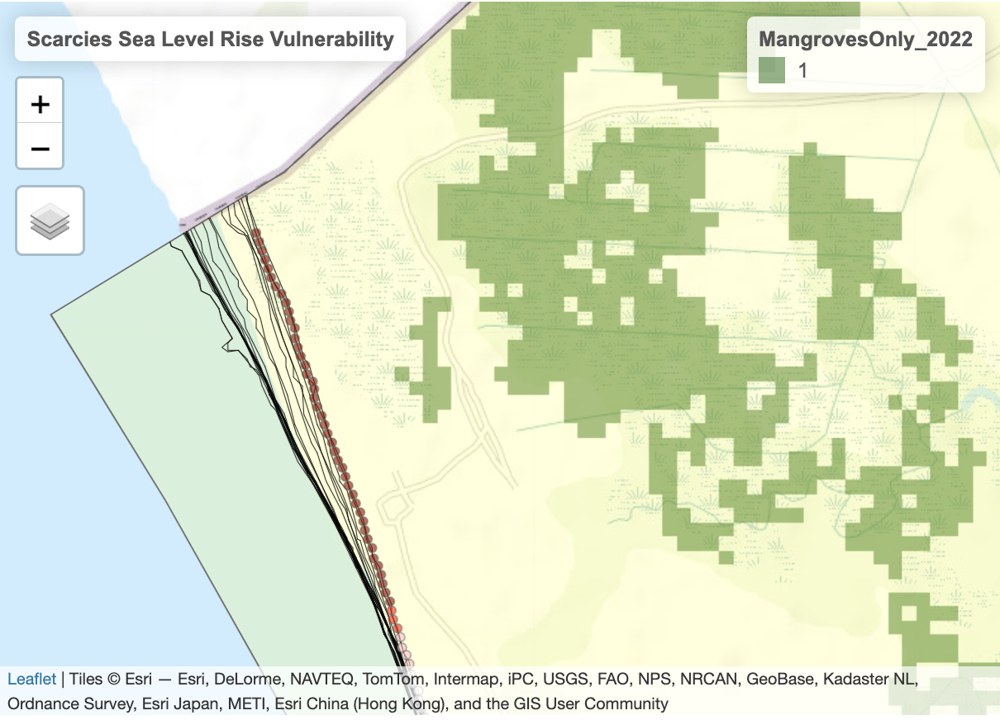

# Exploring Shoreline Change in North West Sierra Leone

This post aims to analyze the rates of shoreline change in the Scarcies region of North West Sierra Leone along the Atlantic Ocean coastline. The analysis will utilize data from the Digital Earth Africa program [Digital Earth Africa program](https://docs.digitalearthafrica.org/en/latest/data_specs/Coastlines_specs.html#Annual-Coastlines-Shorelines) to gain valuable insights into the evolving patterns of coastal movement over time.

```{r, include = F}
#load required packages
library(tidyverse)  # for data manipulation and visualization
library(tmap)  # for interactive thematic mapping
library(sf) # for working with spatial data
library(RColorBrewer)  # for color palettes in data visualization
library(leaflet)  # for interactive web mapping
library(viridis)  # for color palettes in data visualization
library(sp)  # for working with spatial data
library(gridExtra)  # for arranging multiple plots on a page
library(ggpmisc)  # for adding additional layers to ggplot2 plots
library(kableExtra)  # for creating nicely formatted tables in RMarkdown
library(tidytext) # for untokenized functions
library(knitr) # for tables
library(raster) # for raster
library(plotly) # live plots
```

```{r, include = F}
#Area of project extent
scarcies_extent <- st_read("/Users/javipatron/Library/Mobile Documents/com~apple~CloudDocs/Documents/Silvestrum/Sierra Leone/Scarcies_extent_shapefile/Scarcies_extent.shp")

#Shorelines
scarcies_shorelines <- st_read("/Users/javipatron/Library/Mobile Documents/com~apple~CloudDocs/Documents/Silvestrum/Sierra Leone/Scarcies_slr_data/shoreline_annual_2000_2020.shp")

# Annual Coastline rate of change .shp
scarcies_rate_change <- st_read("/Users/javipatron/Library/Mobile Documents/com~apple~CloudDocs/Documents/Silvestrum/Sierra Leone/Scarcies_slr_data/Coastal_retreat_2000_2021_Scarcies.shp")


# Mangtoves in Scarcies Only
mangroves <- raster("/Users/javipatron/Library/Mobile Documents/com~apple~CloudDocs/Documents/Silvestrum/Sierra Leone/MangrovesOnly_2022.tif")

```

## **Visualize the data**

The following image is a screenshot showing the visualization of the data through the interactive map displayed below.

{width="50%"}

### **The map below has the following features:**

-   The area of interest is highlighted in yellow.

-   Data points are represented by different colors, indicating shoreline behavior over time. Please refer to [Table 1] for the color key and cluster counts.

-   To navigate the map and select specific layers, utilize the interactive buttons provided.

-   On the left-hand section, you'll find a "layers button" that allows easy navigation between different data sets.

-   Removing the "World" layer improves the level of detail in the satellite images provided by the tmap() function.

-   The extent of mangroves is displayed in green pixels. (Make sure to deactivate the "World" layer)

```{r, echo = F}
breaks <- c(-Inf, -5, -1, -0.25, 0, 0.25, 1, 5, Inf)
colors <- c("darkred", "red", "pink", "white","white", "lightblue", "blue", "darkblue")

# create a new column "rate_color" with colors corresponding to the rate_time values
scarcies_rate_change$rate_color <- ifelse(scarcies_rate_change$rate_time < breaks[1], colors[1],ifelse(scarcies_rate_change$rate_time >= breaks[length(breaks)], colors[length(colors)],
                                                                                                colors[findInterval(scarcies_rate_change$rate_time, breaks, all.inside = TRUE)]))

# Count the number of colors per point
count_colors <- scarcies_rate_change |> 
  group_by(rate_color) |> 
  summarise(count = n())

color_table <- data.frame(colors = colors,
                          lower_bound = breaks[-length(breaks)],
                          upper_bound = breaks[-1]) 


# assuming that the column with color rates in scarcies_rate_change is called "rate_color"

color_table <- data.frame(colors = colors,
                          lower_bound = breaks[-length(breaks)],
                          upper_bound = breaks[-1]) |> 
  mutate(count = sapply(colors, function(x) {
    scarcies_rate_change %>% filter(rate_color == x) %>% nrow()
  }))
  

```

```{r, echo = F, warning = F, message=F}

data(World)
# Create map
tmap_mode("view")
tm_shape(World) +
  tm_polygons() +
tm_shape(scarcies_extent) +
  tm_polygons(col = "yellow", alpha = 0.2) +
tm_shape(scarcies_shorelines) +
  tm_lines(lwd = 0.5) +
  tm_legend(show = TRUE) +
tm_shape(scarcies_rate_change) +
  tm_dots(col = "rate_color", alpha = 0.6) +
tm_shape(mangroves) +
  tm_raster(palette = "darkgreen", alpha = 0.5, legend.show = TRUE) +
  tm_layout(title = "Interactive Coastal Change Map: Scarcies Region") +
  tm_view(set.view = c(-12.9,9,8.5))
```

## Important Insights

1.  **Challenging Coastline and Model:** The coastline and the model used to measure shoreline distances are complicated due to factors like image noise, currents, deltas, and islands. I suggest divide the region into smaller parts and clean the data for each area individually. This will help analyze the shoreline changes in more detail.

2.  **Outliers:** Values greater than 200 meters are more likely to indicate modeling issues rather than real-world coastal change.

3.  **Noisy data points:** The data set contains 3,920 points categorized as noisy. Additionally, in the year 2001, there are 1,398 fuzzy data points, which have been removed entirely.

4.  **Median values per year:** Using the median values, a linear model suggests an erosion rate of 0.304 meters per year, indicating a potential loss or erosion of 30.4 centimeters annually.

5.  **Mean values per year:** Running a linear model on the mean values indicates that for every one unit increase in year, the mean shoreline distance is projected to grow by 1.4 meters.

## Questions:

1.  Should the focus be on data points that show erosion related to sea-level rise, rather than a broader shoreline analysis?

2.  Are we interested on the correlation between shoreline movement and the presence of mangroves?

3.  Should I use a function like Winsorize() to control outliers (\> 200 ) data points by setting maximum and minimum points for shoreline erosion?

## Data Appendices

### Table 1

The `table 1` establishes color clusters on the interactive map based on the `rate_time`, which represents annual rates of change (in meters per year). These values are calculated by [Digital Africa](https://docs.digitalearthafrica.org/en/latest/data_specs/Coastlines_specs.html#Annual-Coastlines-Shorelines) using linear regression models that analyze shoreline distances over time (excluding outliers). Negative values indicate retreat, while positive values indicate growth.

```{r, echo = F}

table_color = c("#A02700", "#D94C00", "#FFB3B3", "#FFFFFF", "#FFFFFF", "lightblue", "#0099CC", "#5474A3")


kable(color_table,
      caption = "Table 1. Data Points Color Clusters") %>%
  kable_styling(bootstrap_options = c("striped", "hover"),
                full_width = FALSE) |> 
  row_spec(0, background = "gray70") |> 
  row_spec(1, background = table_color[1]) |> 
  row_spec(2, background = table_color[2]) |>
  row_spec(3, background = table_color[3]) |>
  row_spec(4, background = table_color[4]) |>
  row_spec(5, background = table_color[5]) |>
  row_spec(6, background = table_color[6]) |>
  row_spec(7, background = table_color[7]) |> 
  row_spec(8, background = table_color[8])
```

```{r, include = F}

tidy <- scarcies_rate_change %>%
  select(OBJECTID, uid, rate_time, sig_time, se_time, certainty, outl_time, starts_with("dist_"), starts_with("20")) %>%
  rename_with(~gsub("^dist_", "", .x), starts_with("dist_2")) %>%
  mutate(across(starts_with("20"), ~if_else(. == 0, NA_real_, .))) %>% 
  pivot_longer(cols = starts_with("20"), names_to = "year", values_to = "rate_change_m") %>%
  filter(year != 2001) |> 
  select(OBJECTID, uid, rate_time, sig_time, se_time, year, rate_change_m, certainty, outl_time, geometry)


```

```{r, include = F}
# Identify the noisy points
# Convert list column to rows using unnest_tokens
noisy_points <- tidy |> 
  as.data.frame() |>  # Convert to a data frame to use unnest_tokens
  unnest_tokens(year, outl_time) |>  # Convert outl_time to rows with year
  dplyr::select(OBJECTID, uid, year) |>  # Keep only desired columns
  na.omit() |>  # Remove any rows with missing values
  distinct()  # Remove any duplicate rows

# Find the rows to remove by joining with the original data frame
rows_to_remove <- noisy_points %>%
  inner_join(tidy, by = c("uid", "year"))

# Create a filtered version of the data frame without the noisy rows
tidy_filtered <- tidy %>%
  anti_join(rows_to_remove) |>  # Remove the rows found in rows_to_remove
  dplyr::select(-outl_time, -certainty)  # Remove outl_time and certainty columns

yearly_summary <- tidy_filtered %>%
  as.data.frame() %>%
  select(-geometry) %>%
  na.omit() %>%
  group_by(year) %>%
  summarize(min_decile = quantile(rate_change_m, probs = 0.1),
            max_decile = quantile(rate_change_m, probs = 0.9),
            median = median(rate_change_m),
            mean = mean(rate_change_m))


yearly_summary_long <- yearly_summary |> 
  pivot_longer(cols = 2:5,
               names_to = "stat_analysis",
               values_to = "value") |> 
  mutate(year = as.numeric(year))

```

### Histograms

```{r, echo = F, warning = F}
ggplot(tidy, aes(x = rate_change_m, fill = as.factor(year))) +
  geom_histogram(color = "black", bins = 20) +
  facet_wrap(~ year, ncol = 5) +
  scale_fill_manual(values = c("skyblue", "lightgreen", "pink", "orange", "purple", "yellow", "red", "blue", "green", "brown", "gray", "violet", "cyan", "magenta", "coral", "darkgreen", "navy", "maroon", "gold", "sienna", "darkblue")) +
  labs(x = "Rate of Change (m)", y = "Frequency", title = "Shoreline Rates of Change by Year") +
  theme_bw() +
  guides(fill = F)

```

```{r, echo = FALSE}
# # Define a list of colors
# colors <- c("skyblue", "lightgreen", "pink", "orange", "purple", "yellow", "red", "blue", "green", "brown", "gray", "violet", "cyan", "magenta", "coral", "darkgreen", "navy", "maroon", "gold", "sienna", "darkblue")
# 
# 
# years <- c(2000:2020)
# 
# # Iterate through each year from 2000 to 2020
# for (i in seq_along(years)) {
#   # Subset the data for the current year
#   subset_data <- tidy[tidy$year == years[i], ]
#   
#   # Create the histogram plot with a different color for each year
#   plot <- ggplot(subset_data, aes(x = rate_change_m)) +
#     geom_histogram(fill = colors[i], color = "black") +
#     labs(title = paste0("Histogram - Year:", years[i])) +
#     theme_bw() 
#   
#   print(plot)
# }
# 

```

#### The histograms are an overview of the data:

-   Each data point in the histogram represents the shoreline's distance in a specific year compared to the shoreline position in 2021.

-   Negative values indicate shoreline growth, indicating that the shoreline moved further inland compared to 2021.

-   Positive values indicate shoreline erosion or movement away from the reference point over time.

-   The data points in the earlier years are more scattered and show higher volatility. As we approach 2021, the number of data points decreases.

-   Some years exhibit a greater number of data points above and below the 200-meter mark. These extreme values are flagged as potentially noisy based on the metadata provided.

### OLS Model

```{r,echo = F, warning=F, message=F}

yearly_summary %>%
  mutate(year = as.numeric(year)) %>%
  lm(median ~ year, data = .)

print("The result of -0.3042 using the median values year by year indicates that the land is likely eroding at a rate of approximately 0.304 meters per unit of time (e.g., per year). The lm() function in R fits a linear model (OLS).")

yearly_summary %>%
  mutate(year = as.numeric(year)) %>%
  lm(mean ~ year, data = .)


print("The result of 1.398 using the mean values year by year suggests that the land is likely growing at a rate of approximately 1.398 meters per unit of time (e.g., per year). This positive value indicates a direction of coastal growth, with the land expanding over time.")

```

### Linear Model Graph

```{r,echo = F, warning=F, message=F}
# create ggplot line plot
my.formula <- y ~ x

yearly_summary_long |> 
  filter(year %in% c(2000:2020)) |> 
  filter(stat_analysis %in% c("median", "mean")) |> 
  ggplot(aes(x = year, y = value, color = stat_analysis)) +
  geom_line(aes(color = stat_analysis)) +
  geom_point(size = 1, alpha = 0.5, color = "gray30") +
  scale_x_continuous(breaks = seq(2000, 2020, by = 2)) +
  ylim(-40,30) +
  labs(x = "Year", 
       y = "Coastal Movement (m)", 
       color = "Stats_Analysis",
       title = "Graph: Coastal Movement Analysis: Mean and Median Trends",
       subtitle = "Project: Scarcies, Sierra Leone (2000-2021)",
       caption = "Data Source: Digital Earth Africa") +
  theme_classic() +
  geom_hline(yintercept = 0,
             color = "gray80",
             linetype = "dashed") +
   theme(panel.grid.major = element_line(color = "gray80", linetype = "dashed"),
        panel.grid.minor = element_blank()) +
  scale_color_manual(values = c("blue", "red"))+
  geom_smooth(method = lm,
              formula = my.formula,
              size= 0.4,
              se = F,
              alpha = 0.5) +
   stat_poly_eq(formula = my.formula,
               aes(label = paste(..eq.label.., ..rr.label.., sep=  "~~~~~")), 
               size = 3, 
               label.y = "top",
               label.x = "right")

```

### Annual Shoreline Change Rates

#### Webpage vs. OLS Analysis by Year

This code is comparing the `rate_time` values obtained from a webpage with those obtained from an OLS analysis for each year, to identify any differences between the two.

#### Table 2

```{r, echo = F, warning=F, message=F}

lm_test <- tidy_filtered |> 
  as.data.frame() |> 
  select(uid, year, rate_time, rate_change_m) |> 
  group_by(uid, rate_time) |> 
  summarize(linear = list(lm(rate_change_m ~ as.numeric(year)))) %>%
  mutate(linear_coef = map(linear, coef),
         linear_slope = map_dbl(linear_coef, 2)) |> 
  select(-c(linear, linear_coef)) |> 
  rename("Data Point" = uid)

kable(head(lm_test), caption = "Table 2. Model comparison") %>%
  kable_styling(bootstrap_options = c("striped", "hover"), full_width = FALSE)


mean(lm_test$rate_time)
mean(lm_test$linear_slope)
  
```

This table and results provides a comparison between the `rate_time` variable obtained from the digital analysis and the manually computed `linear model` lm().

The table 2, shows the first 6 rows of results exhibiting the `rate_time` value from Digital Africa and the `linear_slope` value *calculated with the lm() function*. To evaluate the model's overall fit, I computed the mean rate_time value, which equaled 0.2033 meters. Furthermore, the linear slope analysis generated a value of 0.1919, which closely aligns with the mean rate_time.
